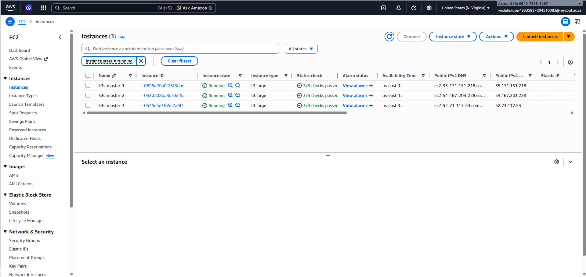
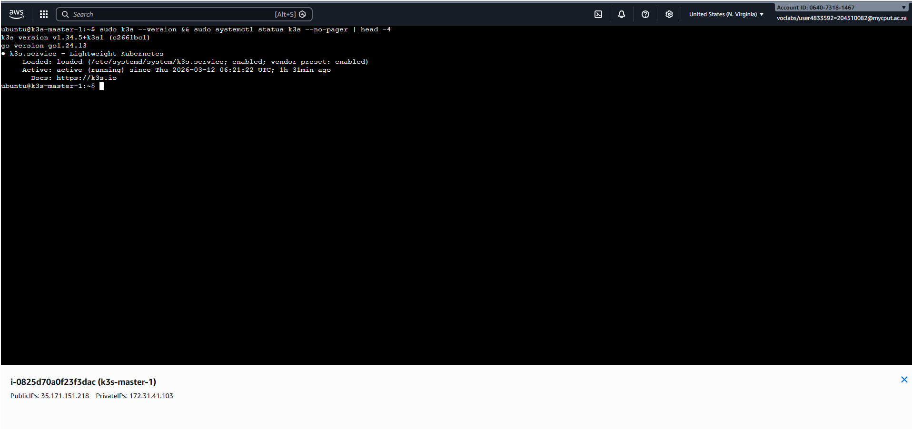
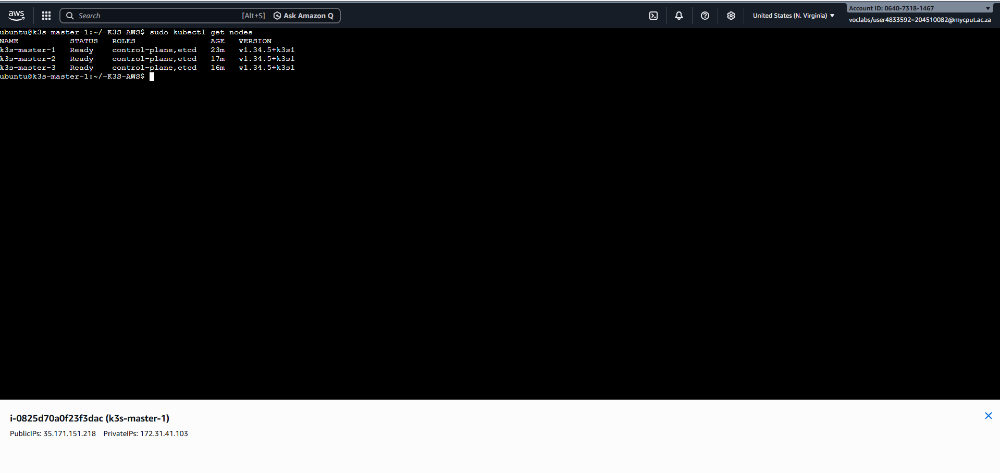
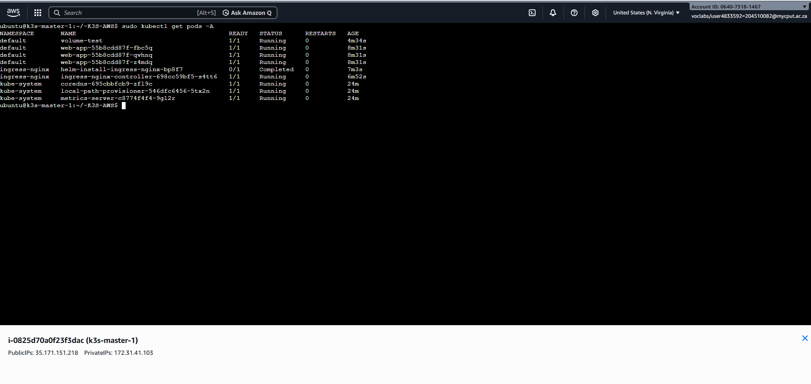

[](https://classroom.github.com/a/w_4Lm1Qk)
# K3s High-Availability Cluster on AWS EC2

This guide walks you through deploying a **K3s HA cluster with 3 master (server) nodes** on AWS EC2 `t3.large` instances using embedded etcd. All examples are AWS-native — no external datastore or load balancer is required to bootstrap the cluster.

> For the full K3s documentation see <https://docs.k3s.io/>.

---

## Architecture

| Role | Count | Instance type | OS |
|------|-------|---------------|----|
| K3s server (master) | 3 | t3.large (2 vCPU / 8 GiB RAM) | Ubuntu 22.04 LTS |

`t3.large` provides enough CPU and RAM to run the K3s control plane (etcd, API server, scheduler, controller-manager) alongside application workloads. All 3 nodes form an HA control plane backed by embedded etcd. Worker nodes can be added later (see [Step 9](#step-9-optional-adding-worker-nodes)).

---

## Prerequisites

- AWS account with permissions to create EC2 instances, VPCs, and security groups
- AWS CLI v2 installed and configured (`aws configure`)
- An EC2 SSH key pair created in the target region
- `kubectl` installed on your local machine

---

## Step 1: AWS Infrastructure Setup

### 1.1 — Variables (set once, reuse throughout)

```sh
export AWS_REGION="us-east-1"
export KEY_NAME="my-k3s-key"        # existing EC2 key pair name
export VPC_ID=$(aws ec2 describe-vpcs \
  --filters "Name=isDefault,Values=true" \
  --query "Vpcs[0].VpcId" --output text \
  --region $AWS_REGION)
export SUBNET_ID=$(aws ec2 describe-subnets \
  --filters "Name=vpc-id,Values=$VPC_ID" \
  --query "Subnets[0].SubnetId" --output text \
  --region $AWS_REGION)
```

### 1.2 — Create a Security Group

```sh
export SG_ID=$(aws ec2 create-security-group \
  --group-name k3s-ha-sg \
  --description "K3s HA cluster security group" \
  --vpc-id $VPC_ID \
  --region $AWS_REGION \
  --query GroupId --output text)

# SSH
aws ec2 authorize-security-group-ingress --group-id $SG_ID \
  --protocol tcp --port 22 --cidr 0.0.0.0/0 --region $AWS_REGION

# Kubernetes API server
aws ec2 authorize-security-group-ingress --group-id $SG_ID \
  --protocol tcp --port 6443 --cidr 0.0.0.0/0 --region $AWS_REGION

# etcd (inter-node only — restrict to the SG itself)
aws ec2 authorize-security-group-ingress --group-id $SG_ID \
  --protocol tcp --port 2379-2380 --source-group $SG_ID --region $AWS_REGION

# Kubelet
aws ec2 authorize-security-group-ingress --group-id $SG_ID \
  --protocol tcp --port 10250 --source-group $SG_ID --region $AWS_REGION

# Flannel VXLAN
aws ec2 authorize-security-group-ingress --group-id $SG_ID \
  --protocol udp --port 8472 --source-group $SG_ID --region $AWS_REGION

# NodePort range (for test applications)
aws ec2 authorize-security-group-ingress --group-id $SG_ID \
  --protocol tcp --port 30000-32767 --cidr 0.0.0.0/0 --region $AWS_REGION

echo "Security group: $SG_ID"
```

### 1.3 — Launch 3 x t3.large Instances

```sh
# Ubuntu 22.04 LTS AMI (update the ami-* ID for your region)
export AMI_ID="ami-0c7217cdde317cfec"   # us-east-1 Ubuntu 22.04 LTS

for i in 1 2 3; do
  aws ec2 run-instances \
    --image-id $AMI_ID \
    --instance-type t3.large \
    --key-name $KEY_NAME \
    --security-group-ids $SG_ID \
    --subnet-id $SUBNET_ID \
    --associate-public-ip-address \
    --tag-specifications "ResourceType=instance,Tags=[{Key=Name,Value=k3s-master-$i}]" \
    --region $AWS_REGION \
    --query "Instances[0].InstanceId" --output text
done
```

> **Note:** Replace `ami-0c7217cdde317cfec` with the latest Ubuntu 22.04 LTS AMI for your region. Find it with:
> ```sh
> aws ec2 describe-images --owners 099720109477 \
>   --filters "Name=name,Values=ubuntu/images/hvm-ssd/ubuntu-jammy-22.04-amd64-server-*" \
>   --query "sort_by(Images,&CreationDate)[-1].ImageId" \
>   --output text --region $AWS_REGION
> ```

### 1.4 — Note the Private and Public IPs

```sh
aws ec2 describe-instances \
  --filters "Name=tag:Name,Values=k3s-master-*" "Name=instance-state-name,Values=running" \
  --query "Reservations[*].Instances[*].[Tags[?Key=='Name']|[0].Value,PrivateIpAddress,PublicIpAddress]" \
  --output table --region $AWS_REGION
```

Record the values — you will need them throughout this guide:

| Hostname | Private IP | Public IP |
|----------|------------|-----------|
| k3s-master-1 | 10.0.x.x | 1.2.3.4 |
| k3s-master-2 | 10.0.x.x | 1.2.3.5 |
| k3s-master-3 | 10.0.x.x | 1.2.3.6 |

---

## Step 2: Prepare All Nodes

Run the following on **each** of the 3 instances.

### 2.1 — SSH into the node

```sh
ssh -i ~/.ssh/$KEY_NAME.pem ubuntu@<public-ip>
```

### 2.2 — Set the hostname (run separately on each node)

```sh
# On k3s-master-1
sudo hostnamectl set-hostname k3s-master-1

# On k3s-master-2
sudo hostnamectl set-hostname k3s-master-2

# On k3s-master-3
sudo hostnamectl set-hostname k3s-master-3
```

### 2.3 — Update packages and set timezone

```sh
sudo apt-get update && sudo apt-get upgrade -y
sudo timedatectl set-timezone UTC
```

### 2.4 — Update `/etc/hosts` on every node

Add an entry for each node so they can resolve each other by hostname. Replace the IPs with your **private** IPs.

```sh
sudo tee -a /etc/hosts <<EOF
10.0.1.10  k3s-master-1
10.0.1.11  k3s-master-2
10.0.1.12  k3s-master-3
EOF
```

> K3s does not require swap to be disabled, but it is recommended for predictable performance.
> ```sh
> sudo swapoff -a
> sudo sed -i '/ swap / s/^/#/' /etc/fstab
> ```

---

## Step 3: Install K3s on the First Master Node

SSH into **k3s-master-1**.

### 3.1 — Create the K3s configuration file

```sh
sudo mkdir -p /etc/rancher/k3s

# Replace 10.0.1.10 with the private IP of k3s-master-1
# Replace 1.2.3.4  with the public IP / Elastic IP of k3s-master-1
sudo tee /etc/rancher/k3s/config.yaml <<EOF
cluster-init: true
node-ip: 10.0.1.10
advertise-address: 10.0.1.10
tls-san:
  - 10.0.1.10
  - 1.2.3.4
  - k3s-master-1
disable: [servicelb, traefik]
EOF
```

> **Why `disable: [servicelb, traefik]`?**
> - `servicelb` (Klipper) is replaced by the AWS cloud controller or an NLB.
> - `traefik` is replaced by the NGINX Ingress Controller in Step 7.
> Using the list syntax avoids the YAML duplicate-key bug where only the last `disable:` entry would take effect.

### 3.2 — Install K3s

```sh
curl -sfL https://get.k3s.io | sh -
```

### 3.3 — Verify the installation

```sh
sudo kubectl get nodes
sudo kubectl get pods -A
```

### 3.4 — Retrieve the cluster join token

```sh
sudo cat /var/lib/rancher/k3s/server/token
```

Save this token — you will need it in the next step.

---

## Step 4: Join Master Nodes 2 and 3

Run the following on **k3s-master-2** and **k3s-master-3** (adjust IPs accordingly).

### 4.1 — Create the K3s configuration file

```sh
sudo mkdir -p /etc/rancher/k3s

# Example for k3s-master-2. Replace IPs and token with your values.
sudo tee /etc/rancher/k3s/config.yaml <<EOF
server: https://10.0.1.10:6443
token: <token-from-master-1>
node-ip: 10.0.1.11
advertise-address: 10.0.1.11
tls-san:
  - 10.0.1.11
  - 1.2.3.5
  - k3s-master-2
disable: [servicelb, traefik]
EOF
```

### 4.2 — Install K3s as a server node

```sh
curl -sfL https://get.k3s.io | sh -s - server
```

### 4.3 — Verify cluster membership (run on any master node)

```sh
sudo kubectl get nodes -o wide
```

All 3 nodes should appear with status `Ready` and role `control-plane,master`.

```
NAME           STATUS   ROLES                       AGE   VERSION
k3s-master-1   Ready    control-plane,etcd,master   5m    v1.30.x+k3s1
k3s-master-2   Ready    control-plane,etcd,master   2m    v1.30.x+k3s1
k3s-master-3   Ready    control-plane,etcd,master   1m    v1.30.x+k3s1
```

---

## Step 5: Configure kubectl Remotely (Optional)

```sh
# Copy the kubeconfig from k3s-master-1 to your local machine
scp -i ~/.ssh/$KEY_NAME.pem ubuntu@<master-1-public-ip>:/etc/rancher/k3s/k3s.yaml ~/.kube/k3s.yaml

# Update the server address to the public IP of a master node
sed -i 's|https://127.0.0.1:6443|https://<master-1-public-ip>:6443|' ~/.kube/k3s.yaml

# Use this kubeconfig
export KUBECONFIG=~/.kube/k3s.yaml

kubectl get nodes
```

---

## Step 6: Deploy a Test Application

```sh
kubectl apply -f web-app.yml

# Verify pods and service
kubectl get pods,svc

# Access the app — use the public IP of any master node and the NodePort
curl http://<master-public-ip>:30080
```

Expected output: `welcome to my web app!`

---

## Step 7: Configure NGINX Ingress Controller

K3s can deploy Helm charts automatically by placing a manifest in `/var/lib/rancher/k3s/server/manifests/`.

```sh
# On k3s-master-1
sudo cp nginx-ingress.yml /var/lib/rancher/k3s/server/manifests/nginx-ingress.yaml

# Verify the controller starts
kubectl -n ingress-nginx get pods
kubectl -n ingress-nginx get svc
```

The `LoadBalancer` service automatically provisions an AWS NLB. The NLB DNS name is shown in the `EXTERNAL-IP` column of `kubectl -n ingress-nginx get svc`.

The `nginx-ingress.yml` manifest in this repository already includes the NLB annotations:
```yaml
service.beta.kubernetes.io/aws-load-balancer-type: "nlb"
service.beta.kubernetes.io/aws-load-balancer-cross-zone-load-balancing-enabled: "true"
```

---

## Step 8: Configure Default Storage

K3s ships with **local-path-provisioner** out-of-the-box. It dynamically provisions `hostPath` volumes on the node where the pod is scheduled. Refer to the [local-path-provisioner docs](https://github.com/rancher/local-path-provisioner/blob/master/README.md#usage) for more configuration options.

### 8.1 — Change the default storage path (optional)

Add the following to `/etc/rancher/k3s/config.yaml` on all master nodes and restart K3s:

```yaml
default-local-storage-path: /mnt/disk1
```

```sh
sudo systemctl restart k3s

# Restart the provisioner to pick up the new path
kubectl -n kube-system rollout restart deploy local-path-provisioner
```

### 8.2 — Test local-path storage

```sh
kubectl create -f pvc.yaml
kubectl create -f pod.yaml

kubectl get pvc
kubectl get pv
kubectl get pod volume-test
```

### 8.3 — EBS CSI driver (production alternative)

For production workloads that need durable, network-attached block storage, install the [AWS EBS CSI driver](https://github.com/kubernetes-sigs/aws-ebs-csi-driver):

```sh
kubectl apply -k "github.com/kubernetes-sigs/aws-ebs-csi-driver/deploy/kubernetes/overlays/stable/?ref=release-1.35"
```

Create a StorageClass backed by EBS:

```yaml
apiVersion: storage.k8s.io/v1
kind: StorageClass
metadata:
  name: ebs-sc
provisioner: ebs.csi.aws.com
volumeBindingMode: WaitForFirstConsumer
parameters:
  type: gp3
```

---

## Step 9: (Optional) Adding Worker Nodes

To add a dedicated worker (agent) node, launch an additional EC2 instance (any type) in the same security group and run:

```sh
# On the new worker node
sudo mkdir -p /etc/rancher/k3s
sudo tee /etc/rancher/k3s/config.yaml <<EOF
server: https://10.0.1.10:6443
token: <token-from-master-1>
node-ip: <worker-private-ip>
EOF

curl -sfL https://get.k3s.io | sh -s - agent
```

Verify on a master node:

```sh
kubectl get nodes -o wide
```

---

## Step 10: Uninstalling K3s

```sh
# On server (master) nodes
/usr/local/bin/k3s-uninstall.sh

# On agent (worker) nodes
/usr/local/bin/k3s-agent-uninstall.sh
```

---

## Troubleshooting

### Check K3s service logs

```sh
journalctl -u k3s -f
```

### Check etcd health

```sh
sudo k3s etcd-snapshot list

# Detailed etcd member list
sudo k3s etcd-snapshot ls

# etcdctl (available inside the K3s binary)
sudo k3s kubectl -n kube-system exec -it \
  $(sudo k3s kubectl -n kube-system get pod -l component=etcd -o jsonpath='{.items[0].metadata.name}') \
  -- etcdctl --endpoints=https://127.0.0.1:2379 \
     --cacert=/var/lib/rancher/k3s/server/tls/etcd/server-ca.crt \
     --cert=/var/lib/rancher/k3s/server/tls/etcd/client.crt \
     --key=/var/lib/rancher/k3s/server/tls/etcd/client.key \
     member list
```

### Nodes stay in `NotReady`

- Check security group rules — ensure ports 8472/UDP (Flannel VXLAN) and 10250/TCP (Kubelet) are open between nodes.
- Verify all nodes can resolve each other's hostnames: `ping k3s-master-2` from k3s-master-1.

### API server unreachable from kubectl

- Ensure port 6443/TCP is open in the security group for your local IP.
- Verify the `server:` URL in your local kubeconfig points to the correct public IP.

### Instance Metadata Service (IMDS)

K3s uses IMDSv2 on EC2 for the node's ProviderID. If you see errors related to instance metadata, ensure IMDSv2 is enabled and the hop limit is at least 2:

```sh
aws ec2 modify-instance-metadata-options \
  --instance-id <instance-id> \
  --http-put-response-hop-limit 2 \
  --http-endpoint enabled \
  --region $AWS_REGION
```

### Private Registry (Amazon ECR)

See `registries.yml` for the ECR configuration. The recommended approach on EC2 is to attach the `AmazonEC2ContainerRegistryReadOnly` IAM policy to the instance profile — no static credentials are needed.


# Assignment 1 — K3s HA Cluster on AWS

**Student Name:** Emeal Dekoker
**Student Number:** 204510082
**GitHub Repo:** https://github.com/cput-it-advdip/open5g-on-aws-ec2-Emeal41

---

## System Requirements

| Component | Specification |
|-----------|--------------|
| Instance Type | t3.large |
| CPU | 2 vCPU |
| RAM | 8 GiB |
| Storage | 8 GB SSD |
| OS | Ubuntu 22.04 LTS |
| Nodes | 3 x Master (control plane) |
| Region | us-east-1 (N. Virginia) |

---

## Architecture

### What is K3s?
K3s is a lightweight, certified Kubernetes distribution built for resource-constrained environments. It packages the entire Kubernetes control plane into a single binary under 100MB, making it ideal for edge computing, IoT, and cloud deployments where cost and simplicity matter. Unlike full Kubernetes, K3s removes legacy and alpha features while keeping full certification and compatibility.

### Why K3s on AWS?
- Lighter than full Kubernetes — uses less CPU and RAM
- Embedded etcd means no external database needed
- Fast to deploy — ideal for learning and prototyping
- Still production-grade and fully certified
- Perfect for simulating 5G edge deployments

### Key Components

**Control Plane (3 x Master Nodes)**
The control plane manages the entire cluster. It runs the API server, scheduler, and controller manager across all 3 master nodes. Having 3 nodes ensures High Availability — if one node fails the other two keep the cluster running without interruption. Each node also runs embedded etcd for distributed state storage.

**Agents (Worker Nodes)**
In this deployment the master nodes also act as workers since K3s allows workloads to run on control plane nodes. Dedicated agent nodes can be added later by joining them with the server token.

**Container Runtime (containerd)**
K3s uses containerd as its default container runtime. containerd is responsible for pulling container images and running containers on each node. It is lightweight and purpose-built for Kubernetes workloads.

**CNI — Flannel**
Flannel is the default Container Network Interface for K3s. It gives each pod its own unique IP address and enables pods to communicate across different nodes using VXLAN tunneling over UDP port 8472.

**Ingress / Load Balancer — NGINX Ingress Controller**
The NGINX Ingress Controller manages external HTTP and HTTPS traffic into the cluster. It acts as a reverse proxy, routing incoming requests to the correct Kubernetes service based on rules defined in Ingress resources.

**Storage — Local Path Provisioner**
K3s ships with a built-in local-path-provisioner that dynamically creates PersistentVolumes on the node's local disk when a pod requests storage through a PersistentVolumeClaim. This is ideal for development and testing environments.

### Architecture Diagram

```
┌─────────────────────────────────────────────────────┐
│                  AWS EC2 (us-east-1)                │
│                                                     │
│  ┌─────────────┐ ┌─────────────┐ ┌─────────────┐   │
│  │  master-1   │ │  master-2   │ │  master-3   │   │
│  │172.31.41.103│ │172.31.44.54 │ │172.31.44.167│   │
│  │    etcd    ◄──►    etcd    ◄──►    etcd     │   │
│  │  API server │ │             │ │             │   │
│  │  scheduler  │ │             │ │             │   │
│  └─────────────┘ └─────────────┘ └─────────────┘   │
│         │               │               │           │
│         └───────────────┴───────────────┘           │
│                     Flannel CNI                     │
│                  (VXLAN UDP 8472)                   │
│                                                     │
│              NGINX Ingress Controller               │
│           Local Path Storage Provisioner            │
└─────────────────────────────────────────────────────┘
```

---

## Environment Setup

### 1. AWS Infrastructure

#### Security Group (k3s-ha-sg) Inbound Rules

| Port | Protocol | Purpose | Source |
|------|----------|---------|--------|
| 22 | TCP | SSH access | 0.0.0.0/0 |
| 6443 | TCP | Kubernetes API server | 0.0.0.0/0 |
| 2379-2380 | TCP | etcd peer communication | k3s-ha-sg |
| 10250 | TCP | Kubelet API | k3s-ha-sg |
| 8472 | UDP | Flannel VXLAN overlay | k3s-ha-sg |
| 30000-32767 | TCP | NodePort services | 0.0.0.0/0 |

#### EC2 Instances Provisioned

| Instance | Private IP | Public IP |
|----------|-----------|-----------|
| k3s-master-1 | 172.31.41.103 | 35.171.151.218 |
| k3s-master-2 | 172.31.44.54 | 54.167.203.228 |
| k3s-master-3 | 172.31.44.167 | 52.73.117.53 |

### 2. Node Preparation (run on all 3 nodes)

```bash
sudo hostnamectl set-hostname k3s-master-X
sudo apt-get update && sudo apt-get upgrade -y
sudo timedatectl set-timezone UTC
sudo swapoff -a
sudo tee -a /etc/hosts <<EOF
172.31.41.103  k3s-master-1
172.31.44.54   k3s-master-2
172.31.44.167  k3s-master-3
EOF
```

### 3. Install K3s on Master-1 (Control Plane Leader)

```bash
sudo mkdir -p /etc/rancher/k3s
sudo tee /etc/rancher/k3s/config.yaml <<EOF
cluster-init: true
node-ip: 172.31.41.103
advertise-address: 172.31.41.103
tls-san:
  - 172.31.41.103
  - 35.171.151.218
  - k3s-master-1
disable: [servicelb, traefik]
EOF
curl -sfL https://get.k3s.io | sh -
```

### 4. Join Master-2 to Cluster

```bash
sudo mkdir -p /etc/rancher/k3s
sudo tee /etc/rancher/k3s/config.yaml <<EOF
server: https://172.31.41.103:6443
token: K10ec0c07424066170266b26cf49255a695e443fb4a6c9868863359ab57916d41cd::server:874123ff986e18d88b8a354a4651f14e
node-ip: 172.31.44.54
advertise-address: 172.31.44.54
tls-san:
  - 172.31.44.54
  - 54.167.203.228
  - k3s-master-2
disable: [servicelb, traefik]
EOF
curl -sfL https://get.k3s.io | sh -s - server
```

### 5. Join Master-3 to Cluster

```bash
sudo mkdir -p /etc/rancher/k3s
sudo tee /etc/rancher/k3s/config.yaml <<EOF
server: https://172.31.41.103:6443
token: K10ec0c07424066170266b26cf49255a695e443fb4a6c9868863359ab57916d41cd::server:874123ff986e18d88b8a354a4651f14e
node-ip: 172.31.44.167
advertise-address: 172.31.44.167
tls-san:
  - 172.31.44.167
  - 52.73.117.53
  - k3s-master-3
disable: [servicelb, traefik]
EOF
curl -sfL https://get.k3s.io | sh -s - server
```

### 6. Verify Cluster

```bash
sudo kubectl get nodes
sudo kubectl get pods -A
```

### 7. Deploy Test Application

```bash
git clone https://github.com/cput-it-advdip/-K3S-AWS.git
cd ./-K3S-AWS
sudo kubectl apply -f web-app.yml
curl http://localhost:30080
```

### 8. NGINX Ingress Controller

```bash
sudo cp nginx-ingress.yml /var/lib/rancher/k3s/server/manifests/nginx-ingress.yaml
sudo kubectl -n ingress-nginx get pods
```

### 9. Persistent Storage

```bash
sudo kubectl create -f pvc.yaml
sudo kubectl create -f pod.yaml
sudo kubectl get pvc
```

---

## Evidence of Deployment

### AWS Console — EC2 Instances Running


### Terminal Output — Successful K3s Installation


### All Nodes Ready


### All Pods Running


---

## Reflection

